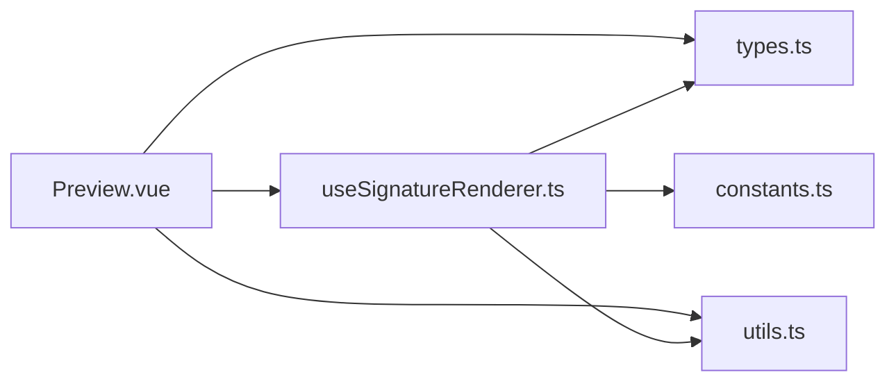
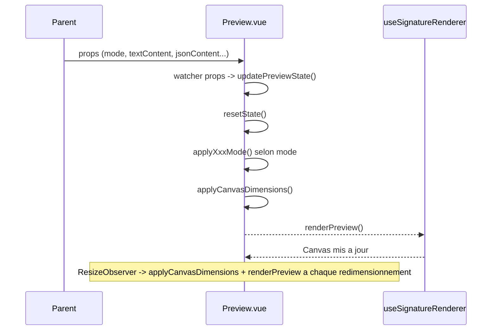

# README - Preview

Ce document decrit le composant Preview, ses modes de fonctionnement, ses props et son cycle de rendu.

## Vue d'ensemble

Preview est un composant de rendu canvas reutilisable. Il affiche une previsualisation de signature selon plusieurs modes d'entree :

- `text` : affichage d'un texte simple (prenom/nom) avec style personnalisable
- `importImage` : affichage d'une image importee adaptee a la taille du conteneur
- `json` : rendu complet depuis un objet ou une chaine JSON (SignatureConfigJson)
- `editSignature` : rendu depuis une config editee en cours
- `compSignature` : rendu compose avec signature centrale + textes haut/bas

Le composant ne gere pas l'export. Il se concentre sur la transformation de donnees en rendu visuel canvas via useSignatureRenderer.

## Localisation

- src/components/elements/Preview.vue

## Props

| Prop | Type | Defaut | Description |
|---|---|---|---|
| mode | `"text" \| "json" \| "editSignature" \| "importImage" \| "compSignature"` | obligatoire | Mode de rendu actif |
| label | string | `""` | Label optionnel |
| textContent | string | `""` | Texte principal (mode text / compSignature) |
| topContent | string | `""` | Texte complementaire haut (mode compSignature) |
| bottomContent | string | `""` | Texte complementaire bas (mode compSignature) |
| textStyle | `Partial<TextBlockOptions>` | `{}` | Styles appliques au texte (font, color, size, bold, italic, underline, alignment) |
| jsonContent | `string \| Partial<SignatureConfigJson> \| null` | `null` | Config JSON (mode json) |
| editSignatureConfig | `Partial<SignatureConfigJson> \| null` | `null` | Config editee (mode editSignature / compSignature) |
| importImageData | string | `""` | Data URL de l'image (mode importImage) |
| width | number | `360` | Largeur de reference du canvas |
| height | number | `220` | Hauteur de reference du canvas |
| showLayoutBorders | boolean | `false` | Affiche les bordures de debug de layout |
| exportWithBackground | boolean | `true` | Fond blanc ou transparent |

## Schema global (fichiers et dependances)

## Schema de fonctionnement (runtime)

## Fonctionnement interne

Le composant maintient un etat interne equivalent aux donnees attendues par useSignatureRenderer :

- etat de signature (source, image, strokes)
- etat nom/prenom
- etat contenus haut et bas (showTopContent, topContentValue, showBottomContent, bottomContentValue)
- etat styles (font, couleur, taille, alignement, gras/italique/souligne)

Il applique une strategie en 3 etapes :

1. `resetState()` : remet tout l'etat a sa valeur par defaut
2. application du mode (`applyTextMode`, `applyImportImageMode`, `applyRichTextMode`, `applyConfig`)
3. `applyCanvasDimensions()` puis `renderPreview()` apres `nextTick()`

## Fonctions principales

- `resetState()`
  - remet tout l'etat interne a sa valeur par defaut
  - les styles par defaut sont pris depuis les props textStyle si disponibles
- `applyConfig(payload)`
  - hydrate l'etat interne depuis une config SignatureConfigJson partielle
  - gere les blocs nom, topContent, bottomContent, et signature (draw/import)
- `parseJsonContent(input)`
  - parse defensif d'une chaine JSON ou d'un objet, retourne null si invalide
- `applyTextMode()`
  - applique textContent/textStyle au bloc nom de preview
- `applyImportImageMode()`
  - applique l'image importee comme source de signature
  - calcule la taille reelle de l'image via updateImportImageSize()
- `applyRichTextMode()`
  - active le bloc haut avec textContent (mode compSignature sans config JSON)
  - equivalent d'un preview texte simple via le moteur topContent
- `applyCanvasDimensions()`
  - calcule la taille physique du canvas selon le mode et la resolution ecran (devicePixelRatio)
  - mode text : hauteur fixe 100px
  - mode editSignature : hauteur fixe 200px
  - mode importImage : mise a l'echelle de l'image dans les contraintes du conteneur
- `updatePreviewState()`
  - orchestrateur principal appele au montage et sur changements de props

## Reactivite

Un watcher profond observe les props suivantes et recalcule le rendu :

- mode, textContent, topContent, bottomContent, textStyle
- jsonContent, editSignatureConfig, importImageData
- width, height, showLayoutBorders, exportWithBackground

Un second watcher leger observe `[mode, textContent]` pour les mises a jour du mode `compSignature`.

Un `ResizeObserver` observe le conteneur et recalcule les dimensions + le rendu lors de tout redimensionnement.

## Template et styles

- Le template rend un canvas unique (`previewCanvasRef`) dans un conteneur (`previewContainerRef`).
- Le canvas prend ses dimensions physiques via `applyCanvasDimensions` (tient compte du devicePixelRatio).
- Le style applique un fond gris clair (#DBDBDB), une bordure, et un fond blanc sur le canvas.

## Cas d'usage recommandes

- preview simple d'un texte de signature (mode `text`, prop `textContent`)
- preview d'une configuration JSON importee (mode `json`, prop `jsonContent`)
- preview d'une image de signature avant validation (mode `importImage`, prop `importImageData`)
- preview en lecture seule d'une configuration editee ailleurs (mode `editSignature`, prop `editSignatureConfig`)
- preview compose avec textes haut/bas + signature centrale (mode `compSignature`, props `topContent`, `bottomContent`, `editSignatureConfig`)

## Ou modifier selon le besoin

- Modifier le rendu visuel : src/components/signature/useSignatureRenderer.ts
- Ajouter un nouveau mode : ajouter une branche dans `updatePreviewState()` et une fonction `applyXxxMode()`
- Modifier les dimensions du canvas selon le mode : fonction `applyCanvasDimensions()` dans Preview.vue
- Modifier les styles visuels du conteneur : balise `<style scoped>` en bas de Preview.vue