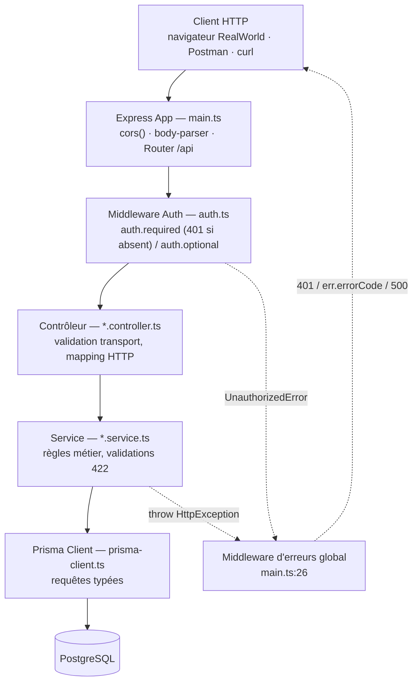
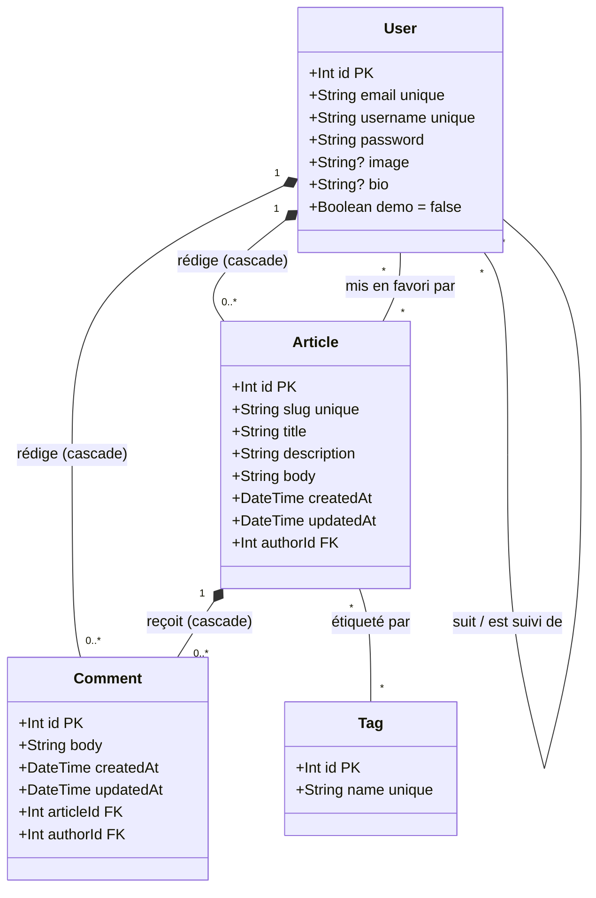

# Conduit API — Documentation technique

Implémentation de référence de la spécification **RealWorld** (un clone de Medium
baptisé « Conduit ») : une API REST en TypeScript exposant l'authentification, les
articles, les commentaires, les profils et les tags, adossée à PostgreSQL via Prisma.

`Express 4.18` · `Prisma 4.16` · `PostgreSQL` · `JWT (HS256)` · `Nx monorepo` · `Jest`

---

## Sommaire

1. [Aperçu](#aperçu)
2. [Stack technique](#stack-technique)
3. [Architecture applicative](#architecture-applicative)
4. [Structure du dépôt](#structure-du-dépôt)
5. [Modèle de données (UML)](#modèle-de-données-uml)
6. [Détail des relations](#détail-des-relations)
7. [Authentification JWT](#authentification-jwt)
8. [Référence API](#référence-api)
9. [Variables d'environnement](#variables-denvironnement)
10. [Build, tests & déploiement](#build-tests--déploiement)

---

## Aperçu

Ce service HTTP fournit l'ensemble des routes attendues par la spécification RealWorld :
inscription et connexion, gestion du profil courant, rédaction et consultation
d'articles, système de favoris, fil d'actualité personnalisé, commentaires, suivi
entre utilisateurs et tags populaires. Toutes les routes sont préfixées par `/api` et
répondent en JSON.

Le projet suit une architecture en couches classique — **route → middleware d'auth →
contrôleur → service → Prisma → PostgreSQL** — avec une séparation nette entre la
validation/transport HTTP (contrôleurs) et les règles métier (services). Un compte de
démonstration (champ `demo` sur `User`) permet d'afficher un jeu de données public
sans authentification.

## Stack technique

| Domaine | Choix | Rôle |
|---|---|---|
| Runtime / framework | `express` 4.18 | Routage HTTP, middlewares |
| Langage | TypeScript 5.2 | Typage statique, compilé via esbuild |
| ORM | `@prisma/client` 4.16 | Accès typé à PostgreSQL, migrations SQL |
| Authentification | `jsonwebtoken` + `express-jwt` | Émission & vérification de JWT (HS256, expiration 60 jours) |
| Mots de passe | `bcryptjs` | Hachage (salt rounds = 10) |
| Slugs | `slugify` | Génération de slug unique `titre-id` pour chaque article |
| Monorepo / build | Nx 17 + `@nx/esbuild` | Orchestration `build` / `serve` / `test` / `lint` |
| Tests | Jest + `jest-mock-extended` | Tests unitaires des services, Prisma mocké |
| Conteneurisation | Docker (`node:lts-alpine`) | Image de production générée par Nx |

## Architecture applicative

Une requête traverse cinq couches avant d'atteindre la base ; le traitement des
erreurs court-circuite ce chemin pour revenir directement au client.



Le chemin nominal descend jusqu'à PostgreSQL ; toute `HttpException` levée par un
service — ou toute `UnauthorizedError` du middleware JWT — remonte directement au
middleware d'erreur global de `main.ts`, sans repasser par le contrôleur.

## Structure du dépôt

Le code applicatif vit sous `src/app/routes`, organisé **par ressource** plutôt que
par type technique : chaque dossier regroupe son contrôleur, son service, ses
modèles et ses éventuels mappers.

```
src/
├─ main.ts                     bootstrap Express, middlewares globaux, handler d'erreurs
├─ prisma/
│  ├─ schema.prisma             modèle de données (User, Article, Comment, Tag)
│  ├─ prisma-client.ts          singleton PrismaClient
│  └─ seed.ts                   jeu de données de démonstration
└─ app/
   ├─ models/
   │  └─ http-exception.model.ts  erreur HTTP typée (errorCode + message)
   └─ routes/
      ├─ routes.ts              agrège les routeurs sous /api
      ├─ auth/                  inscription, connexion, JWT, middleware auth.ts
      ├─ profile/               profils publics, suivi (follow/unfollow)
      ├─ article/               articles, favoris, commentaires, fil perso
      └─ tag/                   top 10 des tags les plus utilisés
```

## Modèle de données (UML)

Quatre entités Prisma composent le schéma (`src/prisma/schema.prisma`) ; deux
relations sont des compositions à suppression en cascade (`onDelete: Cascade`),
trois sont de simples associations n-n portées par des tables de jointure
implicites.



> Les relations `*--` (composition) marquent les suppressions en cascade : effacer
> un `User` efface ses `Article` et `Comment` ; effacer un `Article` efface ses
> `Comment`. Les relations `--` simples sont des associations plusieurs-à-plusieurs
> portées par des tables de jointure Prisma implicites, sans cascade.

## Détail des relations

| Relation | Type | Portée par | Effet |
|---|---|---|---|
| `User → Article` (auteur) | 1 – n | `Article.authorId`, relation `UserArticles` | Supprimer un utilisateur supprime ses articles |
| `User → Comment` (auteur) | 1 – n | `Comment.authorId` | Supprimer un utilisateur supprime ses commentaires |
| `Article → Comment` | 1 – n | `Comment.articleId` | Supprimer un article supprime ses commentaires |
| `Article ↔ Tag` | n – n | table de jointure implicite | Un tag reste s'il est encore utilisé par un autre article |
| `Article ↔ User` (favoris) | n – n | relation `UserFavorites` | Bascule `connect` / `disconnect` sur `favoritedBy` |
| `User ↔ User` (suivi) | n – n auto-relation | relation `UserFollows` (`followedBy` / `following`) | Alimente le fil personnalisé `/articles/feed` |

## Authentification JWT

Le mot de passe est haché avec `bcryptjs` (10 salt rounds) avant stockage. À
l'inscription et à la connexion, `token.utils.ts` signe un JWT `{ user: { id } }`
avec `JWT_SECRET`, valable **60 jours**, en algorithme `HS256`.

Le client renvoie ce jeton dans l'en-tête `Authorization`, sous la forme
`Token <jwt>` ou `Bearer <jwt>` — les deux préfixes sont acceptés par
`getTokenFromHeaders`. Deux middlewares Express-JWT gardent les routes :

- **`auth.required`** — rejette avec **401** toute requête sans jeton valide.
- **`auth.optional`** — laisse passer sans jeton ; `req.auth` reste vide, ce qui
  bascule les services en mode « visiteur » (ex. `favorited` à `false`, seuls les
  articles `demo` sont visibles).

> ⚠️ **Note** — la valeur par défaut `superSecret` du secret JWT (`auth.ts`,
> `token.utils.ts`) n'est qu'un filet de sécurité pour le développement local :
> `JWT_SECRET` doit toujours être défini explicitement en production.

## Référence API

Préfixe commun : `/api`.

### Utilisateurs & session — `auth.controller.ts`

| Méthode | Route | Auth | Description |
|---|---|---|---|
| `POST` | `/users` | aucune | Inscription — `{ user: { username, email, password } }` |
| `POST` | `/users/login` | aucune | Connexion — vérifie le mot de passe, renvoie l'utilisateur + jeton |
| `GET` | `/user` | requise | Utilisateur courant (déduit du JWT) |
| `PUT` | `/user` | requise | Mise à jour partielle du profil courant |

### Profils — `profile.controller.ts`

| Méthode | Route | Auth | Description |
|---|---|---|---|
| `GET` | `/profiles/:username` | optionnelle | Profil public + statut `following` |
| `POST` | `/profiles/:username/follow` | requise | Suivre l'utilisateur |
| `DELETE` | `/profiles/:username/follow` | requise | Ne plus suivre l'utilisateur |

### Articles & commentaires — `article.controller.ts`

| Méthode | Route | Auth | Description |
|---|---|---|---|
| `GET` | `/articles` | optionnelle | Liste paginée — `?offset&limit&tag&author&favorited` |
| `GET` | `/articles/feed` | requise | Articles des auteurs suivis — `?offset&limit` |
| `POST` | `/articles` | requise | Création — `{ title, description, body, tagList }`, slug `titre-id` |
| `GET` | `/articles/:slug` | optionnelle | Détail d'un article |
| `PUT` | `/articles/:slug` | requise | Mise à jour (auteur uniquement, 403 sinon) |
| `DELETE` | `/articles/:slug` | requise | Suppression (auteur uniquement) |
| `GET` | `/articles/:slug/comments` | optionnelle | Commentaires de l'article |
| `POST` | `/articles/:slug/comments` | requise | Ajouter un commentaire |
| `DELETE` | `/articles/:slug/comments/:id` | requise | Supprimer un commentaire (auteur uniquement) |
| `POST` | `/articles/:slug/favorite` | requise | Ajouter aux favoris |
| `DELETE` | `/articles/:slug/favorite` | requise | Retirer des favoris |

### Tags — `tag.controller.ts`

| Méthode | Route | Auth | Description |
|---|---|---|---|
| `GET` | `/tags` | optionnelle | 10 tags les plus utilisés, triés par nombre d'articles |

## Variables d'environnement

| Variable | Rôle |
|---|---|
| `DATABASE_URL` | Chaîne de connexion PostgreSQL utilisée par Prisma |
| `JWT_SECRET` | Clé de signature HS256 des jetons (repli `superSecret` en dev) |
| `NODE_ENV` | `production` en prod ; en `development`, le client Prisma est mis en cache sur `global` |
| `PORT` | Port d'écoute Express (par défaut `3000`) |

## Build, tests & déploiement

```shell
# Génère le client Prisma typé à partir du schéma
npx prisma generate

# Applique les migrations SQL
npx prisma migrate deploy

# Peuple la base via src/prisma/seed.ts
npx prisma db seed

# Démarre l'API en développement (esbuild + @nx/js:node)
nx serve api

# Exécute la suite Jest (services mockés via jest-mock-extended)
nx test api

# Bundle esbuild vers dist/api (format CJS)
nx build api

# Construit l'image node:lts-alpine, exécute `node api` sur le port 3000
nx docker-build api
```
